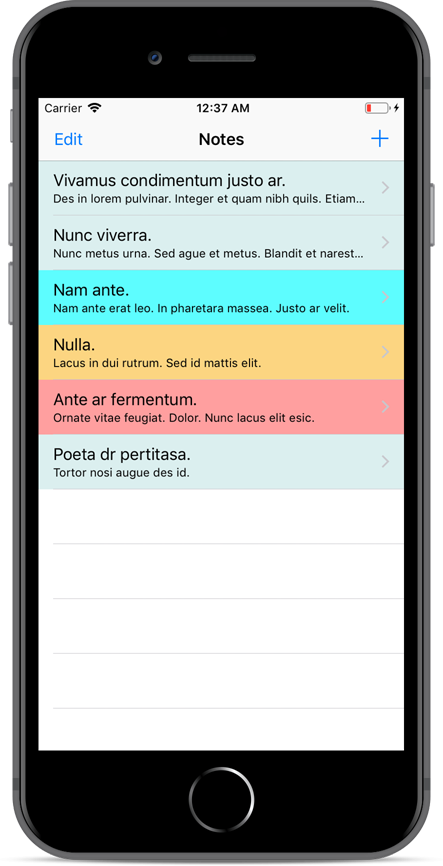

Notes
---
User can create notes and distinguish them by adding colours. App uses Property List and Document Directory to persist data.

* Property List
* Document Directory
* Codable
* Notification Center
* Animating Constraints
* Navigation Controller
* Table View

